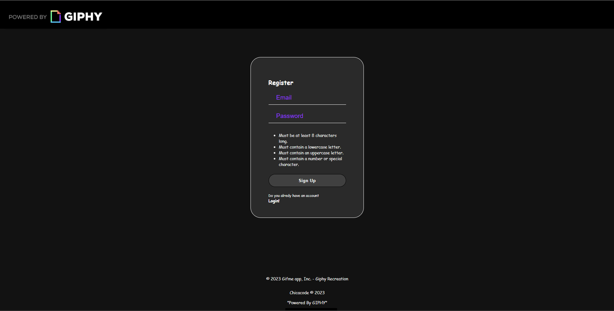
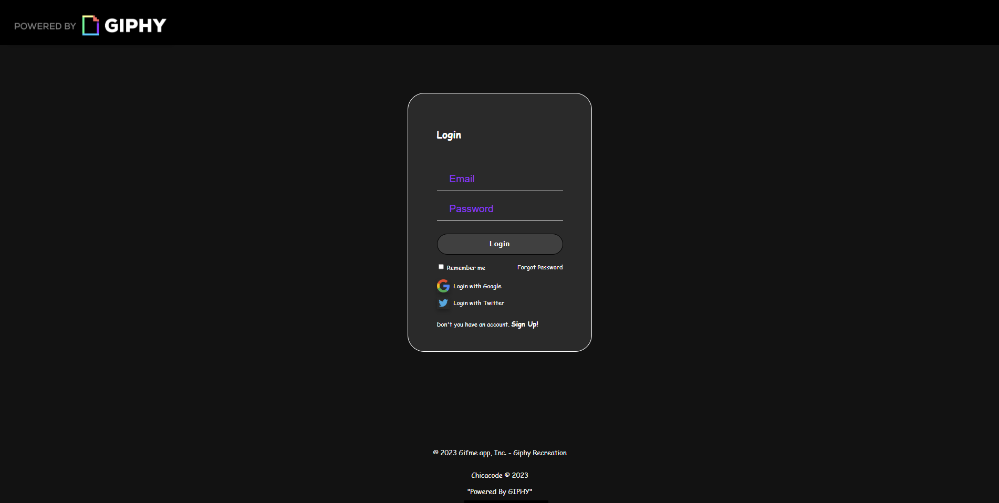
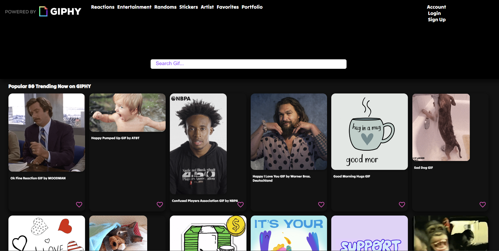
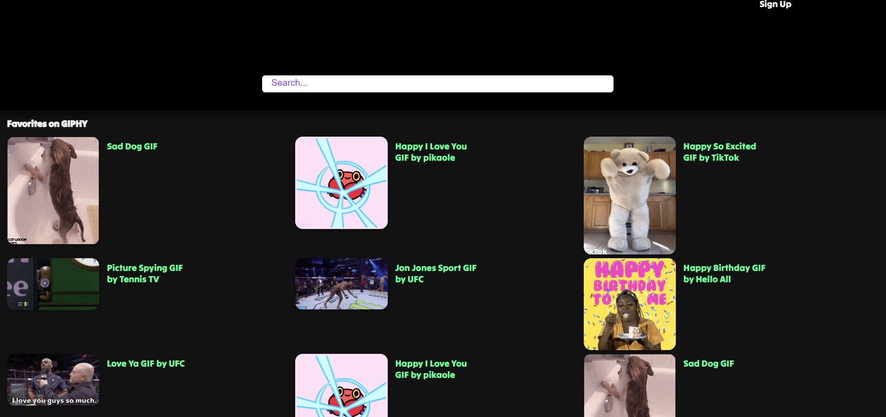

# GIFME APP

## Recreate Giphy with their API (https://developers.giphy.com/docs/api)

- The goal of this project is to build a beautiful page thatyou can use to find GIFs. 

## API from
- `https://developers.giphy.com/docs/api/endpoint/#search`

1. Generate my own API KEY
2. Use Fetch API to get the data
3. Features:

- `Get list of GIFs by trending`
- `Search by gifs name`
- `Register component`
- `Login`
- `Add favorites to a list`
- `Favorites page`

## UI development

## Logo

## Clone this App

`git clone: https://github.com/chicacode/gifme`

## Tech stack used:

- HTML5
- CSS3
- Javscript
- Fetch API GIPHY
- FontAwesome
- Google Fonts
- Material Icons

## Develop by:

# Geri